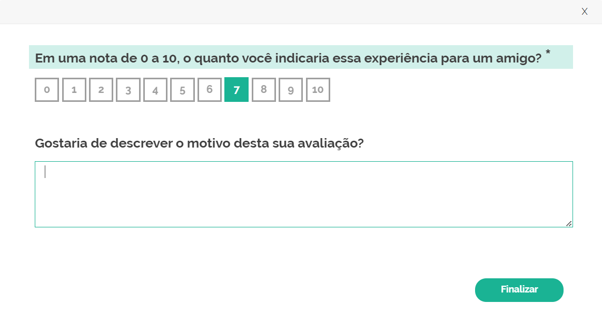

<a name="readme-top"></a>

<br />
<div align="center">
  <a href="http://localhost:3000">
    
  </a>

  <h3 align="center">Pesquisa NPS</h3>
</div>

<!-- SOBRE O PROJETO -->
## Sobre o projeto
POC para o desenvolvimento de uma pesquisa NPS (Net Promoter Score).

### Frameworks / bilbiotecas
- [NodeJS][Node-url]
- [React.js][React-url]
- [SurveyJS][SurveyJS-url]
- [MongoDB][MongoDB-url]

[Node-url]: https://nodejs.org/
[React-url]: https://reactjs.org/
[SurveyJS-url]: https://surveyjs.io/
[MongoDB-url]: https://www.mongodb.com/

<p align="right">(<a href="#readme-top">voltar ao topo</a>)</p>

<!-- INICIANDO -->
## Iniciando

Execute esses passos para rodar o projeto localmente.

### Pré-requisitos

- [WSL2][WSL2-url]
- [Docker][Docker-url]
- [Docker-Compose][Docker-Compose-url]

[Docker-url]: https://www.docker.com/
[Docker-Compose-url]: https://docs.docker.com/compose/
[WSL2-url]: https://learn.microsoft.com/pt-br/windows/wsl/install

### Instalação

Siga os passos para executar o projeto

1. Construa
   ```sh
   make build
   ```
2. Execute
   ```sh
   make run
   ```
3. Pare
   ```sh
   make stop
   ```

<p align="right">(<a href="#readme-top">voltar ao topo</a>)</p>

<!-- Exemplos de uso -->
## Demonstração

### 

<p align="right">(<a href="#readme-top">voltar ao topo</a>)</p>
